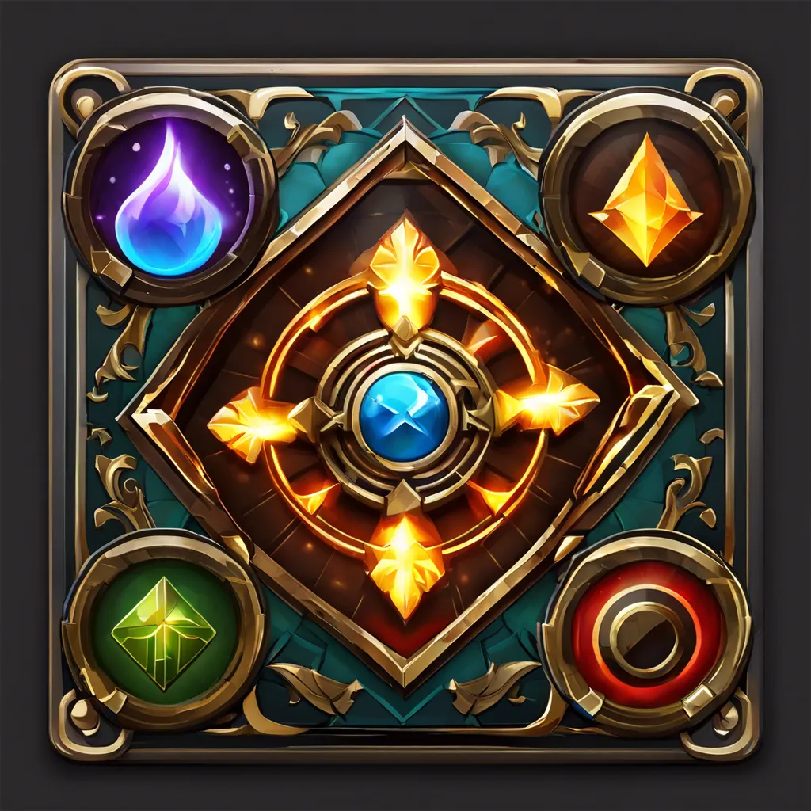

<h1 align="center">MythicEngine</h1>

# О проекте:
*MythicEngine* - игровой движок для создания 2/3D игр под Windows.

# Используемые технологии
- C++ 20
- Directx11
- GTest
- WinAPI

# Текущие модули приложения

## CoreEngine
Данный модуль содержит классы которые используются в основном модуле движка

## Support
Данный модуль содержит макросы и некоторые классы-поддержки для использования во всех модулях

## MythicEngine
Основной модуль приложения

## RenderEngine
Модуль содержит основные компоненты отрисовки и врапперы для отрисовки. Текущий API отрисовки - DirectX11

## MythicTests
Модуль тестирования, которые содержит unit тесты для модулей, которые можно протестировать